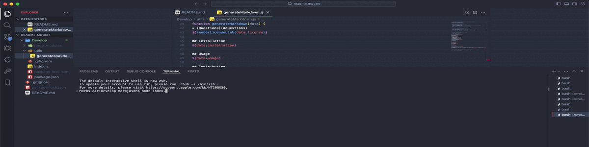
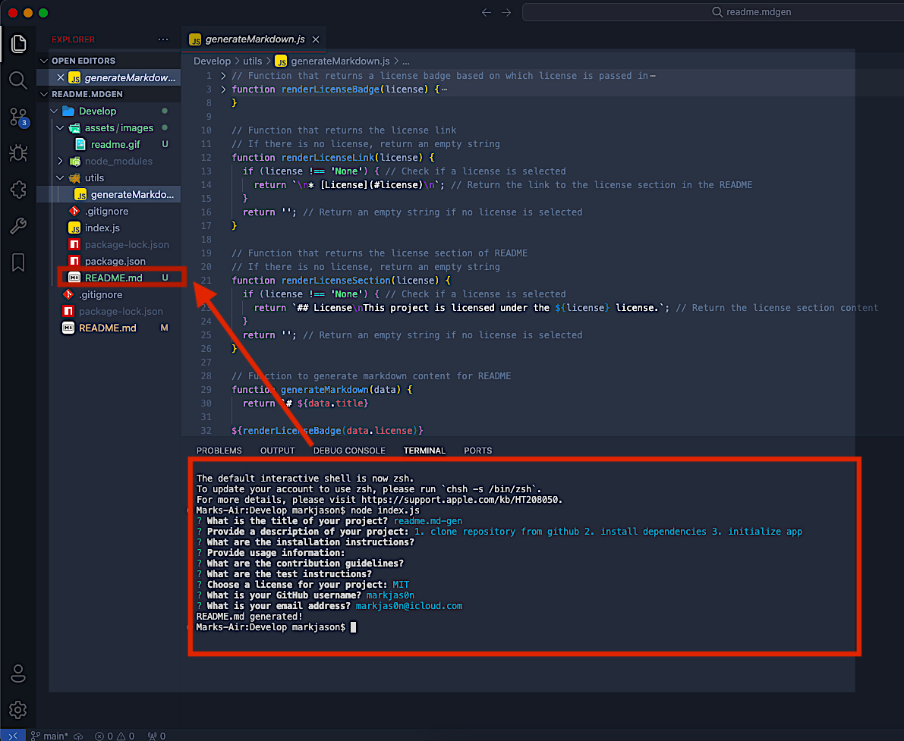
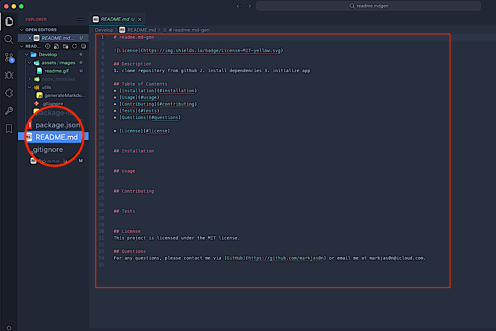

# README Generator


## Description

This command-line application allows developers to quickly generate a professional README.md file for their projects. The application prompts the user for information about the project, including the title, description, installation instructions, usage information, contribution guidelines, test instructions, and license. It then generates a README.md file based on the user's input.





## Table of Contents
* [Installation](#installation)
* [Usage](#usage)
* [License](#license)
* [Contributing](#contributing)
* [Tests](#tests)
* [Questions](#questions)

## Installation

To install and set up the project on your local machine, follow these steps:

1. **Clone the Repository:**
   - Open your terminal and run the following command:
     ```bash
     git clone https://github.com/markjas0n/readme.md-gen.git
     ```
  

2. **Navigate to the Project Directory:**
   - Change into the project directory:
     ```bash
     cd readme.md-gen
     ```  
3. **Install Node.js (if not already installed):**
   - Ensure that Node.js is installed on your system. If it's not, download and install it from [Node.js official website](https://nodejs.org/).

4. **Install Project Dependencies:**
   - Install the necessary npm packages by running:
     ```bash
     npm install
     ```

5. **Run the Application:**
   - Start the application by running:
     ```bash
     node index.js
     ```

## Usage

Once the application is running, follow the prompts to input the necessary information for your README.md file. The application will generate a professional README.md file based on your input, which you can then use in your project.

## License

This project is licensed under the MIT license.

## Contributing

Contributions are welcome! If you have any suggestions or improvements, feel free to submit a pull request or open an issue.

## Tests

There are no specific tests included with this project. However, you can create your own unit tests to validate the functionality of the application.

## Questions

For any questions, please contact me via [GitHub](https://github.com/markjas0n) or email me at markjas0n@icloud.com.